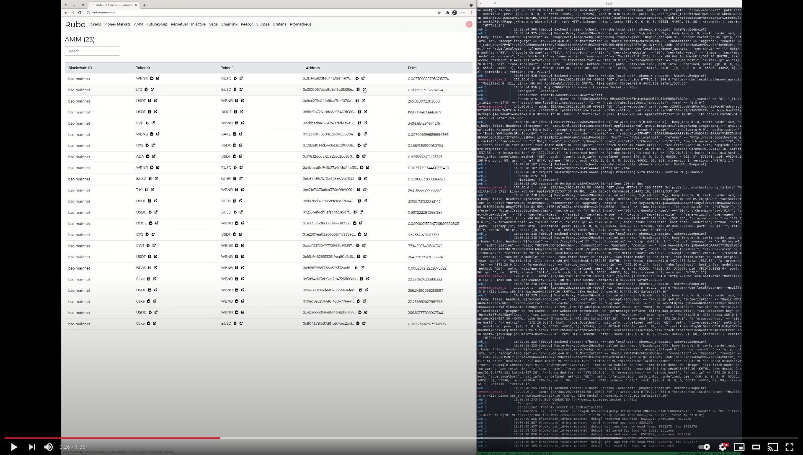

# Rube

[](https://github.com/fremantle-industries/rube/actions?query=workflow%3Atest)
[](https://hex.pm/packages/rube)

A multi-chain DeFi development toolkit for Elixir.

Build upon the configuration DSL provided by [slurp](https://github.com/fremantle-industries/slurp)
then control your on-chain event & transaction subscriptions via the [slurpee](https://github.com/fremantle-industries/slurpee)
and rube GUI's.

[](https://youtu.be/f2phGFZrh80)

| Protocols                                        | Supported | Planned |
| ------------------------------------------------ | :-------: | :-----: |
| ERC20 Tokens                                     |    [x]    |   [ ]   |
| Chainlink                                        |    [x]    |   [ ]   |
| AMM's (Uniswap/Sushiswap/Pancakeswap etc...)     |    [x]    |   [ ]   |
| Money Markets (Aave, Compound, C.R.E.A.M etc...) |    [x]    |   [ ]   |
| Keep3r                                           |    [ ]    |   [x]   |
| Perpetual Protocol                               |    [ ]    |   [x]   |
| FutureSwap                                       |    [ ]    |   [x]   |
| Vega Protocol                                    |    [ ]    |   [x]   |
| Injective Protocol                               |    [ ]    |   [x]   |

## Install

Add `rube` to your list of dependencies in `mix.exs`

```elixir
def deps do
  [
    {:rube, "~> 0.0.2"}
  ]
end
```

## Development

You can run the app natively on the host `http://rube.localhost:4000`

```bash
$ mix setup
$ mix phx.server
```

Or within `docker-compose` `http://rube.localhost`

```
$ docker-compose up
```

When running the application with `docker-compose` you will need to enter the basic auth development credentials:

```
username: admin
passowrd: password
```

## Test

```bash
$ mix test
```

## Help Wanted :)

If you think this `rube` thing might be worthwhile and you don't see a feature
we would love your contributions to add them! Feel free to drop us an email or open
a Github issue.

## Authors

* [Alex Kwiatkowski](https://github.com/rupurt) - alex+git@fremantle.io

## License

`rube` is released under the [MIT license](./LICENSE.md)
